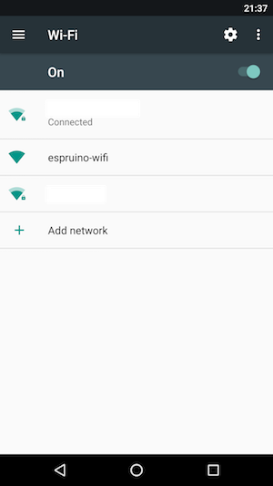
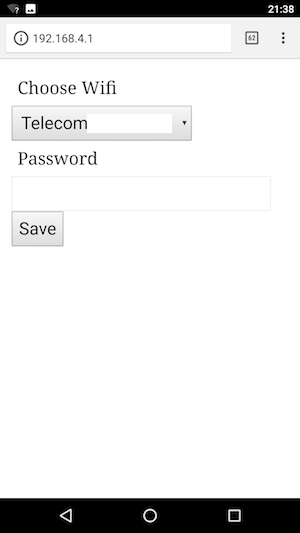

# Espruino Wifi Manager
A library to handle the wifi setup of new objects. Uses FlashEEPROM module to store variables.

# Usage
Import "esp-wifi-manager.js" inside your project, then wrap your code in a function inside conn.

# Demo
In the folder demo there is a modified version of ThingsSDK "Hello World" with Espruino WIFI Manager. The led will blink only after it is connected to the wifi access point.

```javascript
import C from "./esp-wifi-manager.js"; //import the library
let isOn = false;
const interval = 500; // 500 milliseconds = 0.5 seconds
const LED=D2

function main() {
  C(LED, ()=>{
    setInterval(() => {
        isOn = !isOn; // Flips the state on or off
        digitalWrite(LED, isOn); // D2 is the blue LED on the ESP8266 boards
    }, interval);
  })
}
```
# How it works
- After the first boot, the LED will turn on and the Espruino will create an access point called "espruino-wifi".


- Connect to it via your PC or mobile phone, go to 192.168.4.1 and you will see a simple configuration page to enter the SSID and Password;


- Now the espruino will connect to the wifi, turn off the LED, save SSID and Password on Flash (position 0 and 1 of FlashEEPROM) and reboot.
- After the first setup, the espruino will try to connect to the saved SSID and call the callback if successfull. If there are some problems (e.g.: can't find the SSID) it will create again the espruino-wifi access point.

# TODO
- [x] Expose a method to reset connection
- [ ] Use default Wifi.save() to save SSID and Password instead of FlashEEPROM
